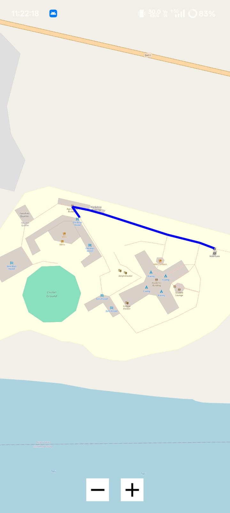
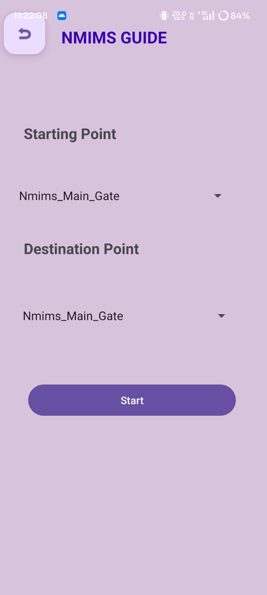
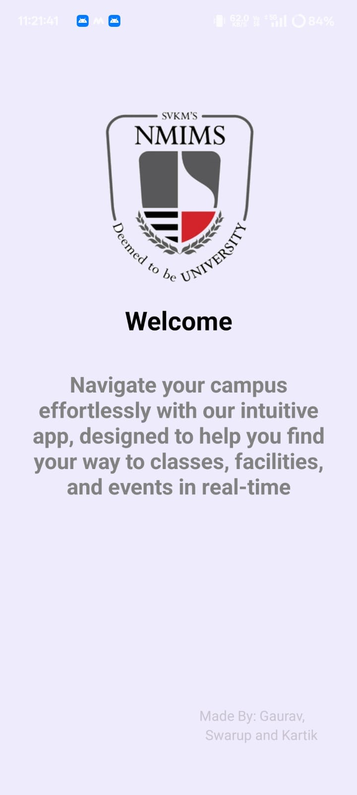
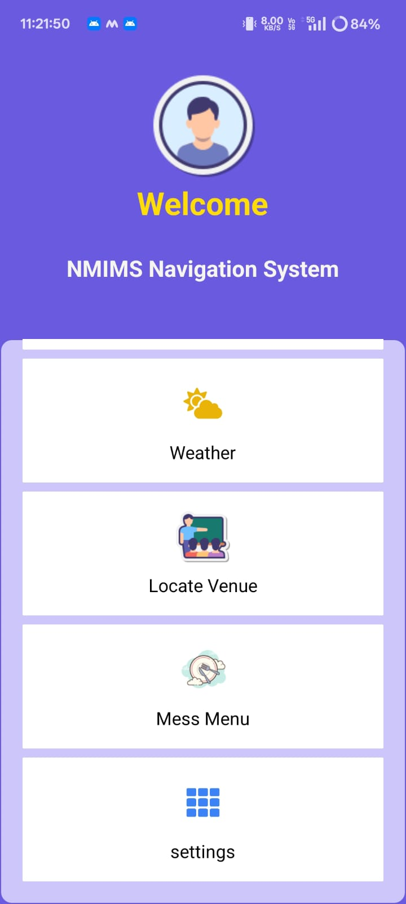
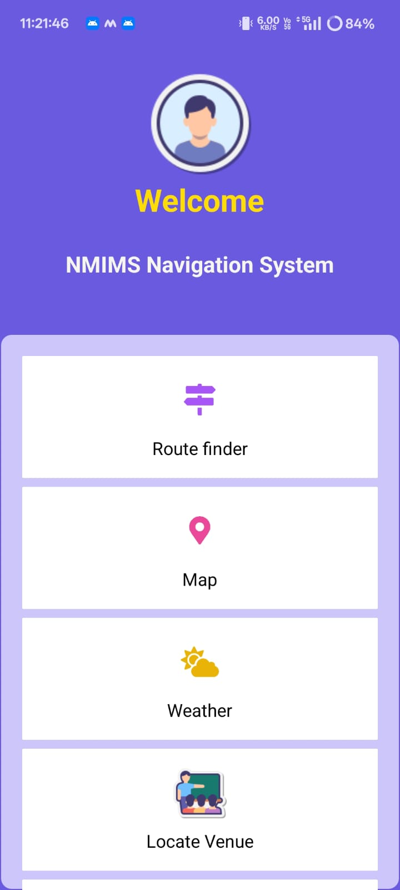

# NMIMSGO-Campus-Navigation-App-project
An Android application designed to help NMIMS students and visitors navigate the campus with ease. This app integrates OpenStreetMap and OpenRouteService API for real-time maps, routing, and location guidance.

---

## ✨ Features  

- 🗺️ **Interactive Map** – Explore the NMIMS campus using OpenStreetMap  
- 🚏 **Route Finder** – Get walking routes between different campus locations  
- 🍴 **Mess Menu** – Daily mess food menu with calorie breakdown  
- 📍 **Locate Venue** – Quickly find classrooms, labs, and facilities  
- 🌦️ **Weather Updates** – Real-time weather information  

---

## 📸 Screenshots  

| Splash Screen | Home Screen | Route Finder |  
|---------------|-------------|--------------|  
|  |  |  |  

| Map View | Mess Menu | Welcome Screen |  
|----------|-----------|----------------|  
|  |  |  |  

---

## 🛠️ Tech Stack  

- **Frontend**: Android (Java/Kotlin)  
- **Maps & Routing**: OpenStreetMap + OpenRouteService API  
- **Backend**: Local JSON / SQLite for Mess Menu  
- **UI/UX**: Material Design Components  

---

